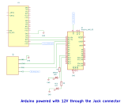

# DISTANCE SENSOR DEMO - DOCUMENTATION

## 1. What the Demo Does

The **Distance Sensor Demo** demonstrates how to measure distances using an **HC-SR04 ultrasonic sensor** and visualize the data on an external display. The project focuses on **real-time communication between the display and the Arduino** through the Lumen Protocol.  

The display receives **live distance readings**, and based on configurable alarm thresholds, it changes its background color:
- **Green** (within the allowed range)
- **Red** (out of bounds)

Additionally, the user can set **minimum and maximum alarm distances** via the display.

## 2. Purpose

This project is designed to showcase the **display’s ability to communicate** with external hardware, providing:
- **Real-time data exchange** between the sensor and the display.
- **Dynamic background color updates** based on threshold values.
- **User-defined distance limits** sent from the display.

This demo is ideal for applications requiring distance monitoring, such as security systems, robotics, and object detection.

## 3. How to Use

### 3.1 Setting Up the Hardware

1. **Connect the HC-SR04 ultrasonic sensor** to the Arduino:
   - **TRIG Pin** → Connect to **Pin 3** on the Arduino.
   - **ECHO Pin** → Connect to **Pin 2** on the Arduino.
   - **VCC** → Connect to **5V**.
   - **GND** → Connect to **GND**.

2. **Connect LEDs for visual feedback**:
   - **Green LED** → **Pin 9** (ON when within range).
   - **Red LED** → **Pin 10** (ON when out of range).

3. **Connect the display** to the Arduino via a serial connection.

## 4. Schematic Circuit

Below is the **schematic circuit** for the Distance Sensor Demo:



## 5. Functionality Explanation

1. **Real-Time Communication**:
   - The display communicates with the Arduino using the **Lumen Protocol**.
   - The Arduino sends **live distance readings** to the display.
   - The display can send **custom alarm thresholds** to the Arduino.

2. **Distance Measurement**:
   - The **HC-SR04** measures the time taken for an ultrasonic pulse to reflect back.
   - The value is converted into centimeters and sent to the display.

3. **Alarm System**:
   - If the measured distance exceeds **Max Distance** or falls below **Min Distance**, the **display background turns red**.
   - If the distance is within limits, the **background remains green**.

## 6. Code Overview

    ```cpp
    #include "LumenProtocol.h"

    extern "C" void lumen_write_bytes(uint8_t* data, uint32_t length) {
      Serial.write(data, length);
    }

    extern "C" uint16_t lumen_get_byte() {
      if (Serial.available()) {
        return Serial.read();
      }
      return DATA_NULL;
    }

    // Definition of addresses and packets
    const uint16_t DISTANCE_ADDRESS = 500;
    const uint16_t ALARM_DIST_MAX_ADDRESS = 520;
    const uint16_t ALARM_DIST_MIN_ADDRESS = 530;
    const uint16_t CHANGE_BACKGROUND_COLOR_ADDRESS = 124;

    // Packets for the measured distance and alarms
    lumen_packet_t Distance = { DISTANCE_ADDRESS, kFloat };
    lumen_packet_t AlarmDistMax = { ALARM_DIST_MAX_ADDRESS, kS32 };
    lumen_packet_t AlarmDistMin = { ALARM_DIST_MIN_ADDRESS, kS32 };
    lumen_packet_t ChangeBackgroundColorPacket = { CHANGE_BACKGROUND_COLOR_ADDRESS, kBool };

    // Distance sensor variables
    const int TRIG_PIN = 3;
    const int ECHO_PIN = 2;
    float distMaxCm = 10.0;       // Maximum distance limit in cm
    float distMinCm = 0.0;        // Minimum distance limit in cm
    float currentDistance = 0.0;  // Variable for the measured distance

    // General variables

    unsigned long timeNow = 0;
    const int GREEN_LED_PIN = 9;
    const int RED_LED_PIN = 10;

    // Filter variables
    const int FILTER_SIZE = 180;  // Size of the filter buffer
    float distanceBuffer[FILTER_SIZE];  // Buffer to store distance readings
    int bufferIndex = 0;  // Index to keep track of the current position in the buffer

    // Initial setup
    void setup() {
      Serial.begin(115200);
      pinMode(TRIG_PIN, OUTPUT);
      pinMode(ECHO_PIN, INPUT);
      pinMode(GREEN_LED_PIN, OUTPUT);
      pinMode(RED_LED_PIN, OUTPUT);
      delay(3000);  // Initialization delay

        // Initialize the distance buffer with zeros
      for (int i = 0; i < FILTER_SIZE; i++) {
        distanceBuffer[i] = 0.0;
      }

    }

    // Main program (loop)
    void loop() {

        // Request the distance in centimeters
        currentDistance = RequestDist();

        // Add the new distance reading to the buffer
        distanceBuffer[bufferIndex] = currentDistance;
        bufferIndex = (bufferIndex + 1) % FILTER_SIZE;  // Circular buffer

        // Calculate the average distance
        float filteredDistance = calculateAverageDistance();

        // Check if distance limits are exceeded and update the background
        if (filteredDistance > distMaxCm || filteredDistance < distMinCm) {
          activateRedBackground();  // Out of limits
        } else {
          activateGreenBackground();  // Within limits
        }

        // Send the filtered distance to the display
        sendDistance(filteredDistance);
      

      // Process received packets
      processReceivedPackets();
    }

    // Processes the received packets and updates as needed
    void processReceivedPackets() {
      while (lumen_available() > 0) {
        lumen_packet_t* currentPacket = lumen_get_first_packet();

        // Update the maximum distance value
        if (currentPacket->address == ALARM_DIST_MAX_ADDRESS) {
          updateAlarmDistanceMax(currentPacket->data._s32);
        }

        // Update the minimum distance value
        if (currentPacket->address == ALARM_DIST_MIN_ADDRESS) {
          updateAlarmDistanceMin(currentPacket->data._s32);
        }
      }
    }

    // Updates the maximum distance value and sends it
    void updateAlarmDistanceMax(float valueAlarm) {
      distMaxCm = valueAlarm;  // Update directly in cm

      // Update and send the maximum distance packet
      sendAlarmDistanceMax();
    }

    // Updates the minimum distance value and sends it
    void updateAlarmDistanceMin(float valueAlarm) {
      distMinCm = valueAlarm;  // Update directly in cm

      // Update and send the minimum distance packet
      sendAlarmDistanceMin();
    }

    // Sends the updated maximum distance
    void sendAlarmDistanceMax() {
      AlarmDistMax.data._s32 = distMaxCm;
      lumen_write_packet(&AlarmDistMax);  // Send the maximum distance packet
    }

    // Sends the updated minimum distance
    void sendAlarmDistanceMin() {
      AlarmDistMin.data._s32 = distMinCm;
      lumen_write_packet(&AlarmDistMin);  // Send the minimum distance packet
    }

    // Sends the measured distance
    void sendDistance(float value) {
      Distance.data._float = value;   // Write the distance into the packet
      lumen_write_packet(&Distance);  // Send the distance packet
    }

    // Function to read the distance from the ultrasonic sensor (in cm)
    float RequestDist() {
      long duration;  // ECHO time
      digitalWrite(TRIG_PIN, LOW);
      delayMicroseconds(2);
      digitalWrite(TRIG_PIN, HIGH);
      delayMicroseconds(10);
      digitalWrite(TRIG_PIN, LOW);
      duration = pulseIn(ECHO_PIN, HIGH);  // Time the Echo pin was HIGH

      return duration / 29.0 / 2.0;  // Convert to centimeters
    }

    // Activates the green background (within limits)
    void activateGreenBackground() {
      digitalWrite(GREEN_LED_PIN, HIGH);
      digitalWrite(RED_LED_PIN, LOW);
      ChangeBackgroundColorPacket.data._bool = false;
      lumen_write_packet(&ChangeBackgroundColorPacket);
    }

    // Activates the red background (out of bounds)
    void activateRedBackground() {
      digitalWrite(GREEN_LED_PIN, LOW);
      digitalWrite(RED_LED_PIN, HIGH);
      ChangeBackgroundColorPacket.data._bool = true;
      lumen_write_packet(&ChangeBackgroundColorPacket);
    }

    // Calculates the average distance from the buffer
    float calculateAverageDistance() {
      float sum = 0.0;
      for (int i = 0; i < FILTER_SIZE; i++) {
        sum += distanceBuffer[i];
      }
      return sum / FILTER_SIZE;
    }
